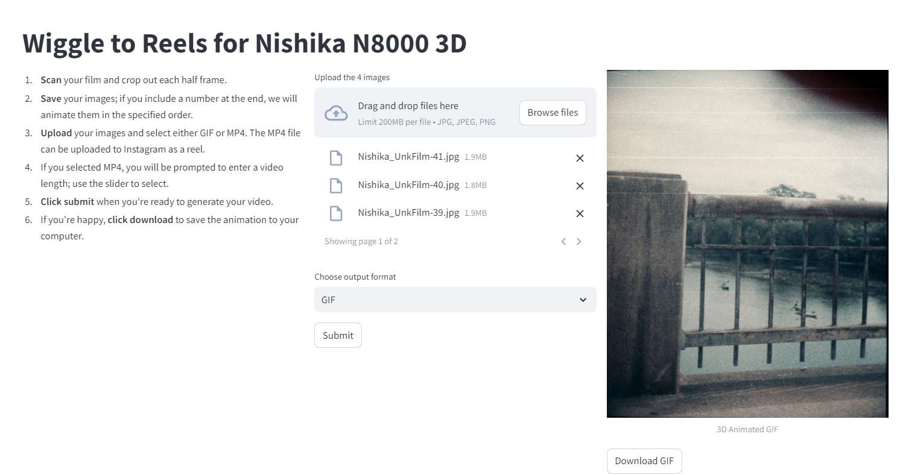

# 📸 Nishika 3D Wigglegram Maker

**Create Wigglegrams In 4 Steps or Less - 100% Free, No Watermarks, Full Resolution.**

A small Streamlit application that automates the registration and animation of **Nishika N8000 3D camera** photos. The **Nishika N8000** is a 35mm camera known for producing holographic prints, also called "wigglegrams," which create a 3D effect when viewed in motion. Now, you can scan your negatives and quickly turn them into animated **GIFs** or **MP4 videos**.

---

## **Features**
- **Wigglegram Animation**: Automatically generate 3D wigglegram animations (GIF or MP4) from your scanned negatives.
- **Customizable Output**: Choose between generating a GIF or MP4 file for easy sharing and viewing.
- **Simple UI**: Use a minimalistic, user-friendly Streamlit interface to upload photos and create animations in just a few clicks.
- **Fast Processing**: Quickly animate your scanned photos with optimized performance.
- **Preview & Download - For Free!**: Quickly animate your scanned photos with optimized performance.

---

## **Demo**
You can view and use **Nishika 3D Wigglegram Maker** live at: [Nishika 3D Wigglegram Maker Live Demo](https://wigglegrams.streamlit.app)  

## Screenshots


## **Installation**
To run the app locally, follow these steps:

1. Clone the repository:
   ```bash
   git clone https://github.com/username/nishika-3d-wigglegram-maker.git
   ```

2. Navigate to the project directory:
   ```bash
   cd nishika-3d-wigglegram-maker
   ```

3. Set up the environment:
   ```bash
   pip install -r requirements.txt
   ```

4. Run the Streamlit app:
   ```bash
   streamlit run app.py
   ```